# Proyecto: Shell Remoto Multihilo - Fase II

Este proyecto es un Shell Remoto Multihilo hecho en Python con sockets TCP. El cliente se conecta al servidor desde otra VM y puede ejecutar comandos remotos permitidos.

En esta Fase II se agregaron mejoras de seguridad, persistencia de usuarios, cifrado, control de clientes simultaneos y manejo de rutas.

## Ambiente experimental

Se usaron dos maquinas virtuales en VirtualBox:

- VM1: Servidor
- VM2: Cliente

Red usada:

- Adaptador NAT para internet.
- Adaptador Red Solo-Anfitrion para comunicar las VMs.

Ejemplo:

- IP servidor: `192.168.56.10`
- Puerto: `5000`

## Funcionalidades agregadas en Fase II

- Limite de 5 clientes simultaneos.
- Uso de `threading.Lock` para controlar el contador de clientes.
- Cifrado SSL/TLS con el modulo `ssl` de Python.
- Usuarios guardados en una base de datos SQLite.
- Contraseñas guardadas con hash SHA-256 y salt.
- Mensajes enviados con prefijo de longitud para evitar cortes.
- Comando `cd`.
- Validacion de rutas para evitar salir de la carpeta raiz del servidor.
- Codigo separado en archivos de red, seguridad y comandos.

## Archivos del proyecto

- `proy-1-srv-tcp.py`: servidor principal.
- `proy-1-cli-tcp.py`: cliente principal.
- `red.py`: envio y recepcion de mensajes.
- `seguridad.py`: base de datos, hash y validacion de usuarios.
- `comandos.py`: logica de comandos.
- `crear_usuario.py`: permite crear usuarios.
- `usuarios.db`: base de datos SQLite.
- `cert.pem`: certificado SSL/TLS.
- `key.pem`: clave privada SSL/TLS.
- `archivos_servidor/`: carpeta raiz permitida.
- `capturas/`: capturas de funcionamiento.

## Cifrado usado

Se uso SSL/TLS mediante el modulo `ssl` de Python.

Para generar el certificado y la clave se ejecuta:

    openssl req -new -x509 -days 365 -nodes -out cert.pem -keyout key.pem

Esto genera:

- `cert.pem`: certificado del servidor.
- `key.pem`: clave privada del servidor.

Como es un laboratorio, se uso un certificado autofirmado.

## Base de datos

Los usuarios se guardan en SQLite en el archivo `usuarios.db`.

La tabla usada es:

    CREATE TABLE usuarios (
        usuario TEXT PRIMARY KEY,
        salt TEXT NOT NULL,
        password_hash TEXT NOT NULL
    );

Las contraseñas no se guardan en texto plano. Se guarda un hash SHA-256 usando salt:

    hash = SHA256(salt + password)

## Comandos disponibles

- `help`: muestra la ayuda.
- `pwd`: muestra el directorio actual.
- `cd <carpeta>`: cambia de directorio.
- `mkdir <nombre>`: crea una carpeta.
- `ls`: lista archivos y carpetas.
- `ls <ruta>`: lista una ruta.
- `ls -l`: lista con detalles.
- `ls -lh`: lista con detalles y tamaños legibles.
- `cat <archivo>`: muestra el contenido de un archivo.
- `exit`: cierra la conexion.

## Diagrama

[Haz clic aqui para ver el diagrama de flujo del programa en Draw.io](https://viewer.diagrams.net/?tags=%7B%7D&lightbox=1&highlight=0000ff&layers=1&nav=1&dark=auto#G1kXnJpY866rruHQWGFLyG78zgCwemsJ6J)

## Como ejecutarlo

### 1. Preparar el proyecto en la VM servidor

Entrar a la carpeta del proyecto:

    cd ~/tarea

Crear la carpeta raiz del servidor si no existe:

    mkdir -p archivos_servidor

Crear un archivo de prueba:

    echo "hola desde fase 2" > archivos_servidor/prueba.txt

### 2. Generar certificado SSL/TLS

En la misma carpeta del proyecto ejecutar:

    openssl req -new -x509 -days 365 -nodes -out cert.pem -keyout key.pem

Esto genera los archivos `cert.pem` y `key.pem`, necesarios para que el servidor use SSL/TLS.

### 3. Crear usuario en la base de datos

Ejecutar:

    python3 crear_usuario.py

Ejemplo de usuario:

    usuario: mateo
    password: tuda

Ese usuario queda guardado en `usuarios.db`.

### Importante

El archivo `red.py` debe estar tanto en la carpeta del servidor como en la carpeta del cliente, porque ambos programas lo usan para enviar y recibir mensajes con prefijo de longitud.

En la VM servidor deben estar:

    proy-1-srv-tcp.py
    red.py
    seguridad.py
    comandos.py
    crear_usuario.py
    usuarios.db
    cert.pem
    key.pem
    archivos_servidor/

En la VM cliente deben estar:

    proy-1-cli-tcp.py
    red.py
    
### 4. Ejecutar el servidor

En la VM servidor:

    python3 proy-1-srv-tcp.py

Debe aparecer algo parecido a:

    server seguro escuchando en el puerto 5000...

### 5. Ejecutar el cliente

En la VM cliente:

    python3 proy-1-cli-tcp.py

Ingresar el usuario y password creados anteriormente.

## Capturas

### Base de datos y archivos del proyecto

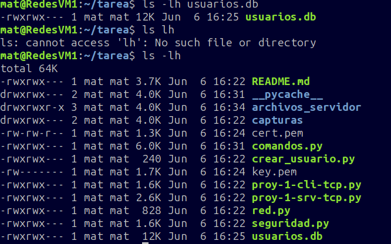

### Servidor seguro funcionando

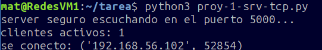

### Login correcto

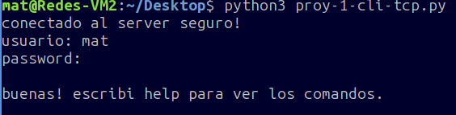

### Comando help

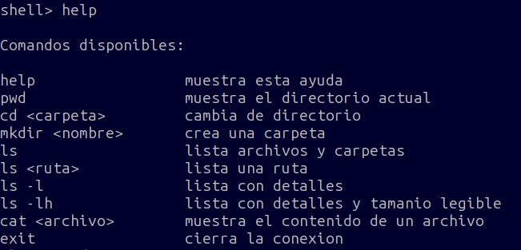

### Comando pwd

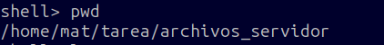

### Comando ls

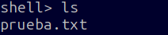

### Comando ls -l

### Comando ls -lh

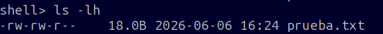

### Comando cat

### Comando mkdir

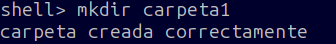

### Comando cd

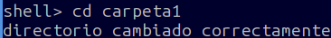

### Comando pwd dentro de carpeta

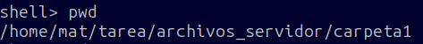

### Comando cat dentro de subcarpeta

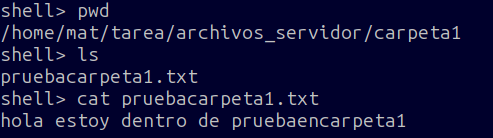

### Bloqueo de Path Traversal

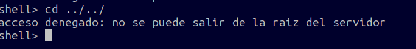

### Vuelta a la raiz del servidor

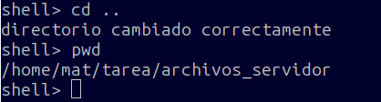

### Login incorrecto

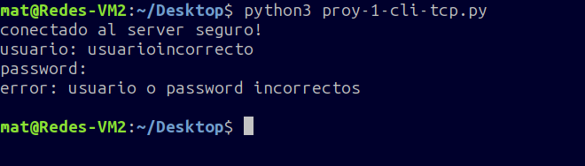

### Prueba multihilo

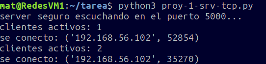

### Desconexion de cliente

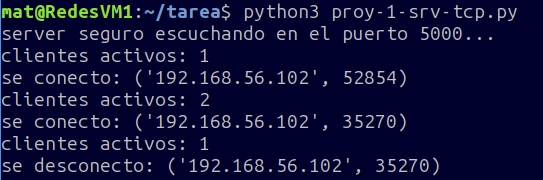

## Estructura del proyecto

    tp-shell-remoto-mateomazuela/
    |
    ├── proy-1-srv-tcp.py
    ├── proy-1-cli-tcp.py
    ├── red.py
    ├── seguridad.py
    ├── comandos.py
    ├── crear_usuario.py
    ├── usuarios.db
    ├── cert.pem
    ├── key.pem
    ├── README.md
    |
    ├── archivos_servidor/
    │   └── prueba.txt
    |
    └── capturas/
        ├── servidor-fase2.png
        ├── crear-usuario.png
        ├── bd-usuarios.png
        ├── login-fase2.png
        ├── help-fase2.png
        ├── pwd-fase2.png
        ├── ls-fase2.png
        ├── ls-l-fase2.png
        ├── ls-lh-fase2.png
        ├── cat-fase2.png
        ├── mkdir-fase2.png
        ├── cd-carpeta-fase2.png
        ├── pwd-carpeta-fase2.png
        ├── cat-subcarpeta-fase2.png
        ├── path-traversal.png
        ├── cd-vuelve-raiz.png
        ├── login-incorrecto-fase2.png
        ├── multihilo-fase2.png
        └── desconexion-cliente-fase2.png
